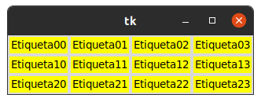
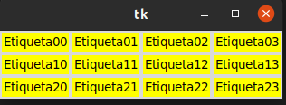
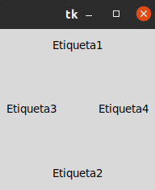
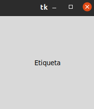

# 1. POSICIONAMIENTO Y DISEÑO
### Con grid la distribuccion de los widgets se realiza de una manera mas flexible utilizando un diseño cuadricula. De esta manera, cada widget en la celda determinada por la interseccion de una fila y una columna. 

## GESTOR DE GEOMETRIA PACK 
### CON GESTOR DE GEOMETRIA DISTTRIBUYE LOS WIDGETS EN HORIZONTAL O EN VERTICAL

## GESTOR DE GEOMETRIA PLEACE
### ESTE GESTOR PERMITE COLOCAR WIDGETS EN COODENADAS ESPECIFICAS DE LA VENTANA PRINCIPAL O DEL WIDGETS CONTENEDOR
